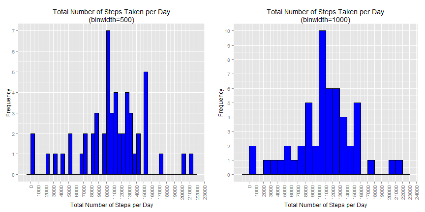
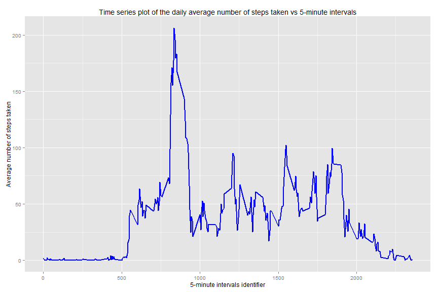
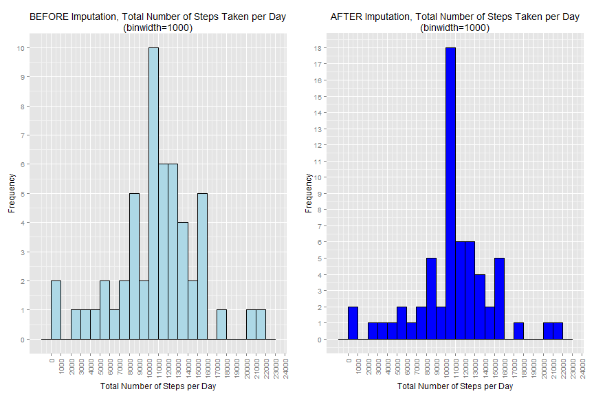
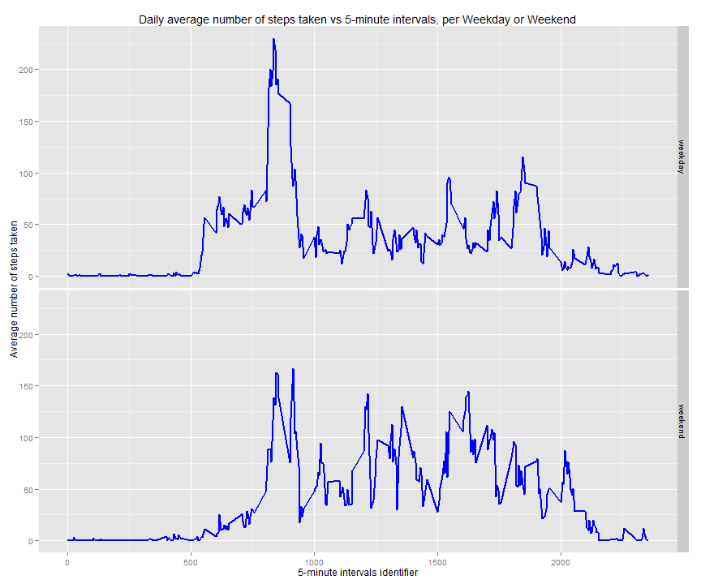

<style>
code {background-color:#dddddd;}
</style>
Data Science: Reproducible Research, Project #1
===============================================


```r
require(ggplot2)  
require(gridExtra)  
```

## Loading and preprocessing the data
#### Load activity data:

```r
if (!is.element('activity.csv', dir())) {  
    unzip("activity.zip")  
}  
activity <- read.csv("activity.csv")  
activity[,"date"] <- as.Date(activity[,"date"])  
```

#### Expose data dimension & data sample:

```r
dim(activity)  
```

```
## [1] 17568     3
```

```r
head(with(activity, activity[!is.na(steps) & (steps > 0),]))  
```

```
##     steps       date interval
## 555   117 2012-10-02     2210
## 556     9 2012-10-02     2215
## 627     4 2012-10-03      410
## 631    36 2012-10-03      430
## 644    25 2012-10-03      535
## 647    90 2012-10-03      550
```

-------------------------
## What is mean total number of steps taken per day?

#### Calculate the total number of steps taken per day, aggregate.

#### Function to plot histogram: 

```r
plotHistogram <- function(df, bin, cTitle, clr) {  
    gp <- ggplot(aes(x=steps), data=df) +  
      geom_histogram(binwidth=bin, position="dodge", colour="black", fill=clr) +  
      scale_x_continuous(breaks=seq(from=0, to=25000, by=1000)) +  
      scale_y_continuous(breaks=seq(from=0, to=20, by=1)) +  
      labs(x="Total Number of Steps per Day", y="Frequency",  
           title=paste(cTitle, "\n(binwidth=", bin, ")", sep="")) +  
      theme(axis.text.x=element_text(angle=90, vjust=0.5, hjust=1))  
    return(gp)  
}  
```

#### Make histogram of the total number of steps taken each day:
*In this case, 2 histograms are plotted with different binwidth (500 and 1000)*

```r
steps_sum <- aggregate(steps ~ date, data=activity, FUN=sum)  
gp1 <- plotHistogram(steps_sum, 500, "Total Number of Steps Taken per Day", clr="blue")  
gp2 <- plotHistogram(steps_sum, 1000, "Total Number of Steps Taken per Day", clr="blue")  
gpAll <- grid.arrange(gp1, gp2, ncol=2)  
```

 

#### Calculate and report the mean and median of the total number of steps taken per day:

```r
sprintf("mean = %.3f", mean(steps_sum$steps, na.rm=TRUE))  
```

```
## [1] "mean = 10766.189"
```

```r
sprintf("median = %.3f", median(steps_sum$steps, na.rm=TRUE))  
```

```
## [1] "median = 10765.000"
```

-------------------------
## What is the average daily activity pattern?

#### Make a time series plot of the 5-minute interval (x-axis) and the average number of steps taken, averaged across all days (y-axis).


```r
steps_average <- aggregate(steps ~ interval, data=activity, FUN=mean)  
  
gp <- ggplot(aes(x=interval, y=steps), data=steps_average) +  
  geom_line(colour="blue", size=1.0) +  
  labs(x="5-minute intervals identifier",  
       y = "Average number of steps taken",   
    title="Time series plot of the daily average number of steps taken vs 5-minute intervals")  
print(gp)  
```

 

#### Which 5-minute interval, on average across all the days in the dataset, contains the maximum number of steps?

```r
max_steps <- max(steps_average$steps)  
sprintf("Maximum number of steps = %.3f", max_steps)  
```

```
## [1] "Maximum number of steps = 206.170"
```

```r
row_index <- which(steps_average$steps == max_steps)  
sprintf("5-minute interval with maximum number of steps = row %d", row_index)  
```

```
## [1] "5-minute interval with maximum number of steps = row 104"
```
**It is row `104` contains maximum number of steps (`206.170`).**  
This is the row data:  

```r
steps_average[row_index,]  
```

```
##     interval    steps
## 104      835 206.1698
```

-------------------------
## Imputing missing values

#### Calculate and report the total number of missing values in the dataset

```r
sprintf("Number of missing values = %d", sum(is.na(activity)))  
```

```
## [1] "Number of missing values = 2304"
```

#### Devise a strategy for filling in all of the missing values in the dataset. The strategy does not need to be sophisticated. For example, you could use the mean/median for that day, or the mean for that 5-minute interval, etc.

#### Create a new dataset that is equal to the original dataset but with the missing data filled in. 
#### Use "mean" for the 5-minute interval to fill missing (NA) values.
Intersection of `activity` and `steps_average` is `interval`, merge by `interval`:  

```r
activity1 <- merge(x=activity, y=steps_average, by="interval")  
names(activity1)[2] <- "steps"  
missing <- which( is.na(activity1$steps) )  
```
Imputation:  

```r
activity1[missing, "steps"] <- activity1[missing, "steps.y",]  
```
#### Make a histogram of the total number of steps taken each day.
#### Compare BEFORE and AFTER imputation. 

```r
steps_sum1 <- aggregate(steps ~ date, data=activity1, FUN=sum)  
gp1 <- plotHistogram(steps_sum, 1000, "BEFORE Imputation, Total Number of Steps Taken per Day", clr="lightblue")  
gp2 <- plotHistogram(steps_sum1, 1000, "AFTER Imputation, Total Number of Steps Taken per Day", clr="blue")  
gpAll <- grid.arrange(gp1, gp2, ncol=2)  
```

 

#### Calculate and report the mean and median total number of steps taken per day.

```r
sprintf("mean = %.3f", mean(steps_sum1$steps, na.rm=TRUE))  
```

```
## [1] "mean = 10766.189"
```

```r
sprintf("median = %.3f", median(steps_sum1$steps, na.rm=TRUE))  
```

```
## [1] "median = 10766.189"
```

#### Do these values differ from the estimates from the first part of the assignment? 
The values differ for `median`, but the same for `mean`.  
*First mean = 10766.189, Second mean = 10766.189  
*First median = 10765.000, Second median = 10766.189  

#### What is the impact of imputing missing data on the estimates of the total daily number of steps?
- Without imputing, there is inonsistency among data, estimation is biased.
- Imputing missing values make data **more consistent statistically**.
- This is proven by more **consistent** values of median and mean.
- In this case after imputation, mean = median = 10766.189. Thus consistent statistically. 

-------------------------
## Are there differences in activity patterns between weekdays and weekends?

#### For this part the `weekdays()` function may be of some help here. Use the dataset with the filled-in missing values for this part.

#### Create a new factor variable in the dataset with two levels - "weekday" and "weekend" indicating whether a given date is a weekday or weekend day.

```r
activity1 <- within(activity1,  
  isWeekend <- ifelse(weekdays(date) %in% c("Saturday", "Sunday"), "weekend", "weekday"))  
```


```r
head(activity1, 10)  
```

```
##    interval    steps       date  steps.y isWeekend
## 1         0 1.716981 2012-10-01 1.716981   weekday
## 2         0 0.000000 2012-11-23 1.716981   weekday
## 3         0 0.000000 2012-10-28 1.716981   weekend
## 4         0 0.000000 2012-11-06 1.716981   weekday
## 5         0 0.000000 2012-11-24 1.716981   weekend
## 6         0 0.000000 2012-11-15 1.716981   weekday
## 7         0 0.000000 2012-10-20 1.716981   weekend
## 8         0 0.000000 2012-11-16 1.716981   weekday
## 9         0 0.000000 2012-11-07 1.716981   weekday
## 10        0 0.000000 2012-11-25 1.716981   weekend
```

#### Make a panel plot containing a time series plot of the 5-minute interval (x-axis) and the average number of steps taken, averaged across all weekday days or weekend days (y-axis). 
*See the README file in the GitHub repository to see an example of what this plot should look like using simulated data.*

```r
steps_average = aggregate(steps ~ interval + isWeekend, data=activity1, FUN=mean)  
gp <- ggplot(aes(x=interval, y=steps), data=steps_average) +  
  geom_line(colour="blue", size=1.0) +  
  facet_grid(isWeekend~.) +  
  labs(x="5-minute intervals identifier", y="Average number of steps taken",  
    title="Daily average number of steps taken vs 5-minute intervals, per Weekday or Weekend")  
print(gp)  
```

 
<hr>
---------------------------------------
